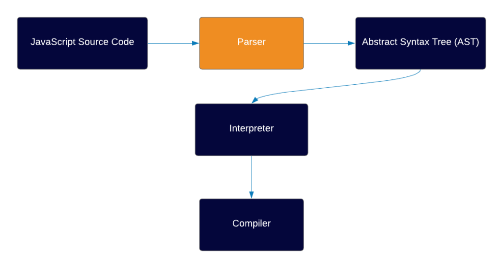
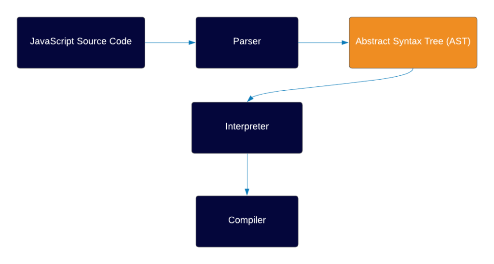
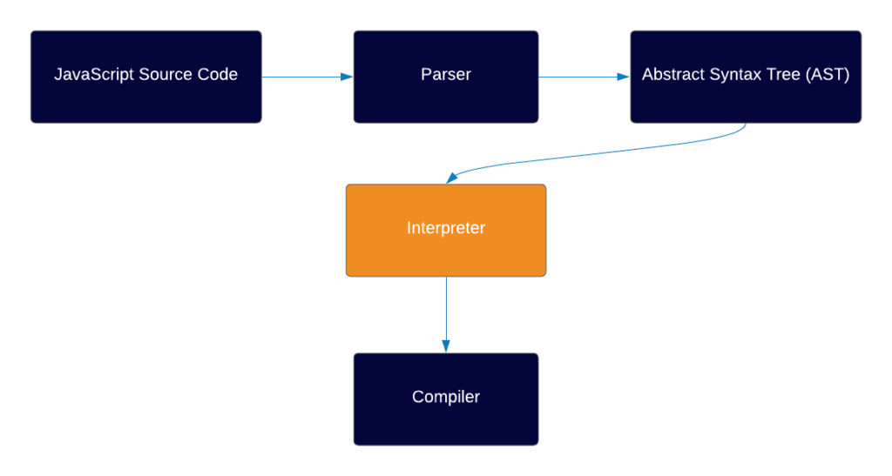
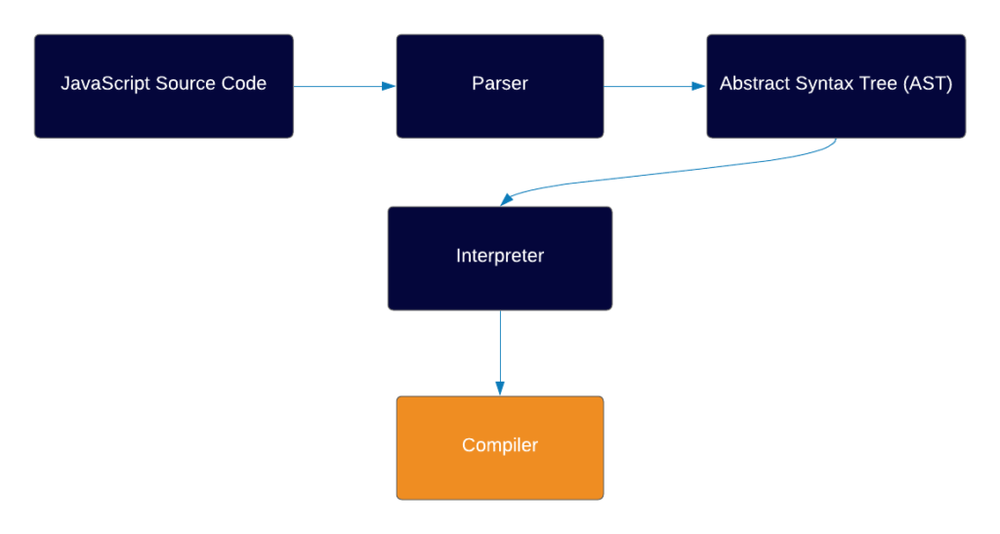

# JavaScript_Assessment4
---------------------------------------
# Question 1
## How does the JS engine work?
Answer - Here Is how JS Engine Works

* Environment
Behind the scenes, JS always runs in a certain environment, most common ones are:

- Browser (by far the most common)
- Node.js (which is a runtime environment which allows you to run JS outside of the browser, usually in servers)

* Engine

- When you write code in JS, you write it in human-readable syntax, with alphabets and numbers. As  mentioned, a machine can not understand this type of code.

- This is why each environment has an engine.

- In general, the engine’s job is to take that code and transform it into machine code which can eventually be run by the computer processor.

- Each environment has its own engine, the most common ones are Chrome V8  (which Node also uses ), Firefox SpiderMonkey, JavaScriptCore by Safari and Chakra by IE.

* Parser

- The parser knows JS syntax and rules, and its job is to go through the code line by line and check if the syntax of the code is correct.
- If the parser comes across an error, it stops running and sends out an error. If the code is valid, the parser generates something that’s called an Abstract Syntax Tree (or AST for short).

* Abstract Syntax Tree (AST)

- AST is a data structure, which is not unique to JS but actually used by a lot of other languages (some of them are Java, C#, Ruby, Python).
- An AST is simply a tree representation of your code, and the main reason the engine creates an AST instead of compiling directly to a machine code is that it’s easier to convert to machine code when you have the code inside a tree data structure.

* The Interpreter

- The Interpreter’s job is to take the AST that has been created and transform it into an Intermediate Representation of the code (IR).

* The Compiler

- The compiler’s job is to take the IR which the interpreter created, which is in our case Bytecode, and transform it into a machine code with certain optimizations.
* There are 3 ways to turn high-level code into machine code and run it:

* 1 - Interpretation — with this strategy you have an Interpreter which goes through the code line by line and executes it (not so efficient).
* 2 - Ahead of Time Compilation (AOT) — here you have a compiler first compiling the entire code, and only then executing it.
* 3 - Just-In-Time Compilation — Combination between the AOT strategy and the interpretation strategy, a JIT compilation strategy attempts to take the best from both worlds, performing dynamic compilation, but also allowing certain optimizations to happen, which really speeds up the compilation process. We’ll explain more about JIT compilation.

---------------------------------------      
