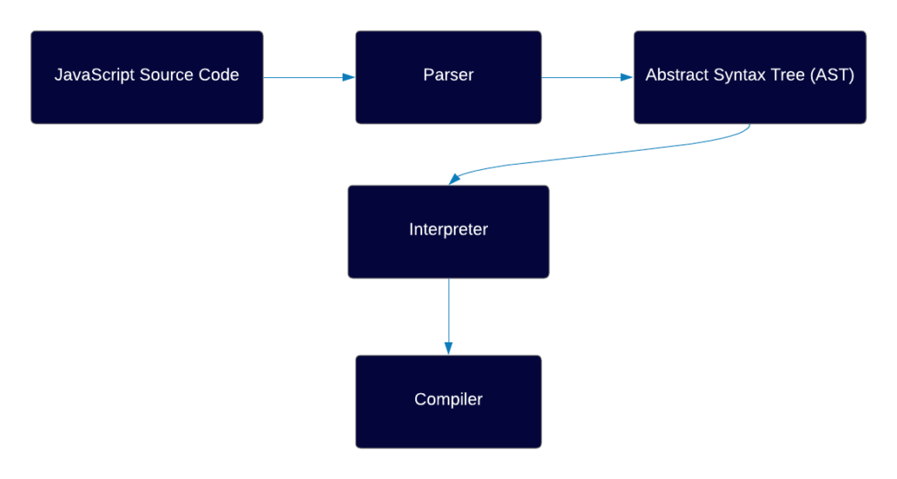
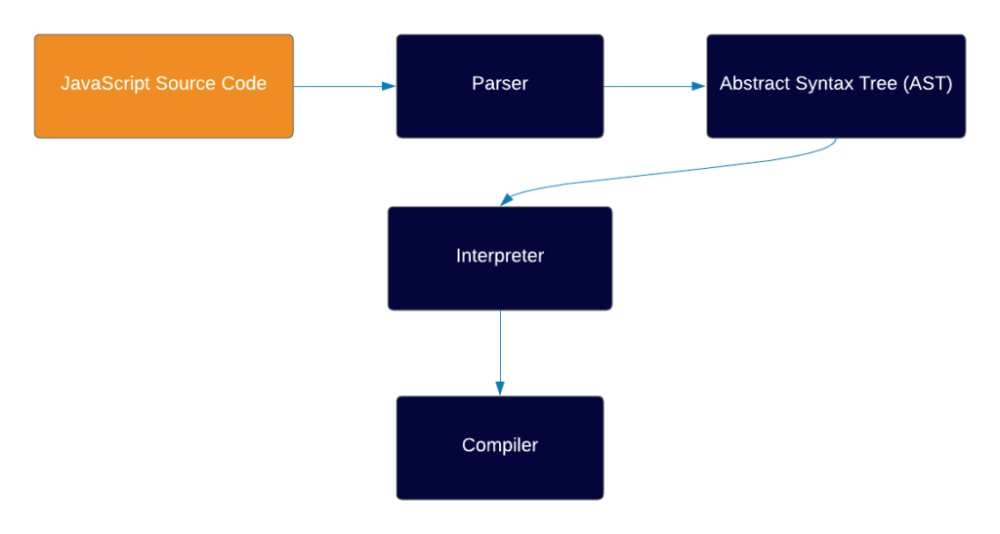

# JavaScript_Assessment4
---------------------------------------
# Question 1
## How does the JS engine work?
Answer - Here Is how JS Engine Works

* Environment
Behind the scenes, JS always runs in a certain environment, most common ones are:

Browser (by far the most common)
Node.js (which is a runtime environment which allows you to run JS outside of the browser, usually in servers)

* Engine

---------------------------------------      

[def]: image8.png